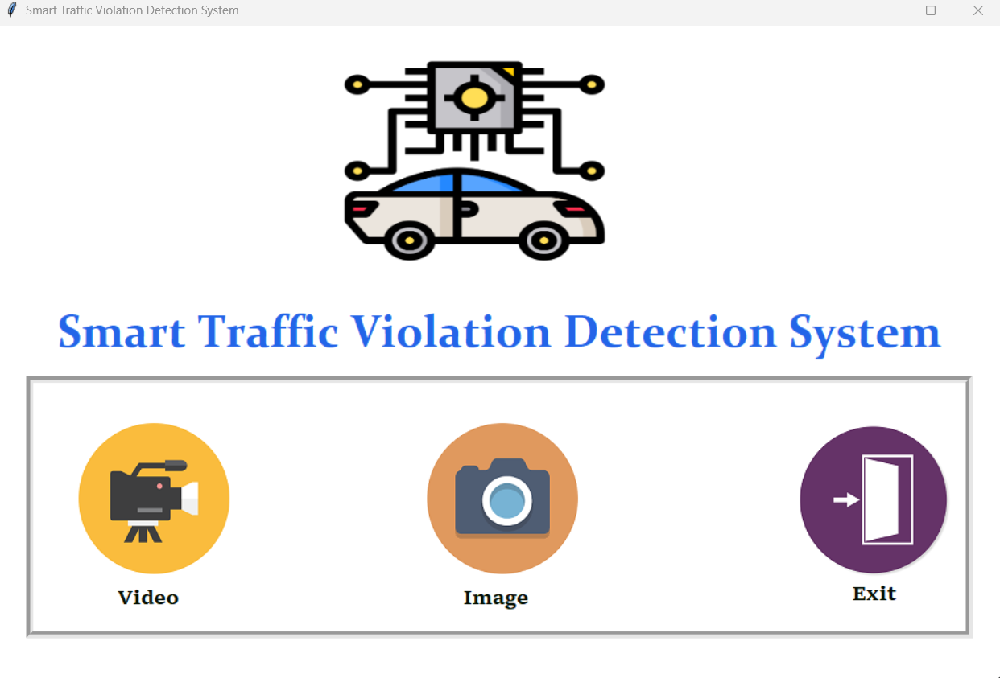
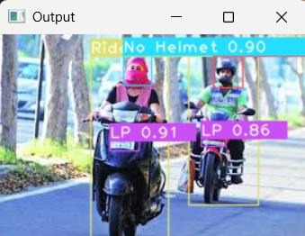

# 🚦 Smart Traffic Violation Detection System


An **AI-powered traffic monitoring system** that automatically detects traffic violations such as **helmet-less riding, triple riding, and license plate recognition** using **Deep Learning and Computer Vision**.

The system analyzes traffic **images or videos** and automatically generates and sends an **e-challan notification via email** to the vehicle owner.

---

# 📌 Project Overview

Urban road accidents often occur due to violations like:

- Riding without helmet
- Triple riding
- Traffic rule violations

Traditional monitoring systems require **manual supervision**, which is inefficient for large-scale traffic monitoring.

This project introduces an **Automated Smart Traffic Violation Detection System** using:

- **YOLOv5 for object detection**
- **CNN for violation analysis**
- **License Plate Recognition**
- **Automatic e-Challan generation**
- **Email notification system**

---

# ✨ Features

✔ Helmet Detection  
✔ Triple Riding Detection  
✔ License Plate Detection  
✔ Automatic Violation Identification  
✔ Automatic Challan Generation  
✔ Email Notification System  
✔ User-Friendly GUI Interface  
✔ Deep Learning-based Traffic Monitoring  

---

# 🧠 Technologies Used

| Technology | Purpose |
|------------|--------|
| Python | Core Programming |
| YOLOv5 | Object Detection |
| OpenCV | Image Processing |
| CNN | Image Classification |
| Tkinter | GUI Development |
| SMTP | Email Notification |
| NumPy | Numerical Computation |

---

# 🏗 System Workflow

```
Traffic Image / Video
        ↓
YOLOv5 Object Detection
        ↓
Helmet Detection
Triple Riding Detection
License Plate Detection
        ↓
Violation Identification
        ↓
Challan Generation
        ↓
Email Notification Sent
```

---

# 📷 Project Screenshots

Create a folder called **images** inside your repository and upload your screenshots.

Example:

```
Major-Project
│
├── images
    ├── Login.png
│   ├── interface.png
│   ├── detection.png
│   ├── challan_sent.png
│   └── email.png
```

Then add images like this:

## Login


## Application Interface



## Violation Detection



## Challan Generated


## Email Notification


---

# ⚙ Installation

### 1. Clone the repository

```bash
git clone https://github.com/Varsha-peddireddy/Major-Project.git
```

### 2. Navigate to project directory

```bash
cd Major-Project
```

### 3. Install required dependencies

```bash
pip install -r requirements.txt
```

If requirements file doesn't work install manually:

```bash
pip install opencv-python numpy pillow torch torchvision
```

### 4. Run the project

```bash
python StartProject.py
```

---

# ▶ How to Use

1. Run the application using `StartProject.py`
2. The GUI interface will open
3. Upload or process traffic image/video
4. System detects:
   - Helmet status
   - License plate
   - Passenger count
5. If violation detected → click **Send Challan**
6. Email notification will be sent automatically

---

# 📂 Project Structure

```
Major-Project
│
├── StartProject.py
├── Run_Detection.py
├── TrafficRuleDetector.py
├── TrafficRuleDetectorImg.py
├── LaneTrafficRuleDetectorImg.py
├── object_detection.py
├── mainGUI_support.py
│
├── requirements.txt
├── rider.png
├── test.py
│
├── images
    ├── Login.png
│   ├── interface.png
│   ├── detection.png
│   ├── challan_sent.png
│   └── email.png
│
└── README.md
```

---

# 📧 Example Challan Email

```
Dear Citizen,

Your vehicle MH12AB1234 violated traffic rules.

Violation: Helmet Not Wearing
Fine Amount: ₹500

Please pay within 7 days.

Traffic Department
```

---

# 🚀 Future Enhancements

- Real-time CCTV camera integration
- Integration with Government RTO database
- SMS notification system
- Web dashboard for monitoring
- Online fine payment system

---


